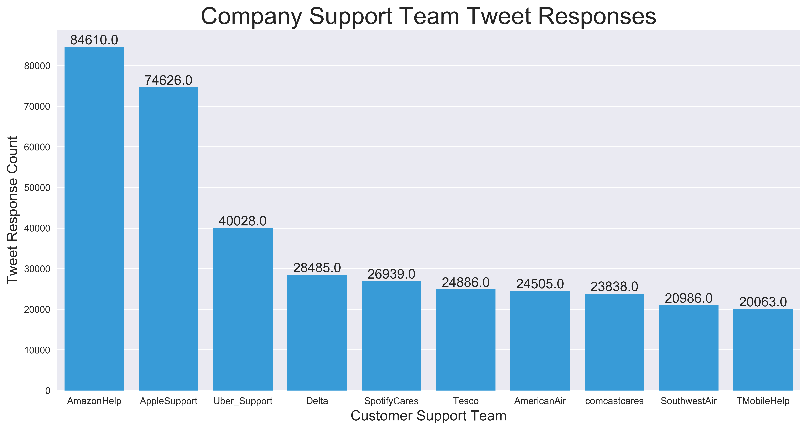
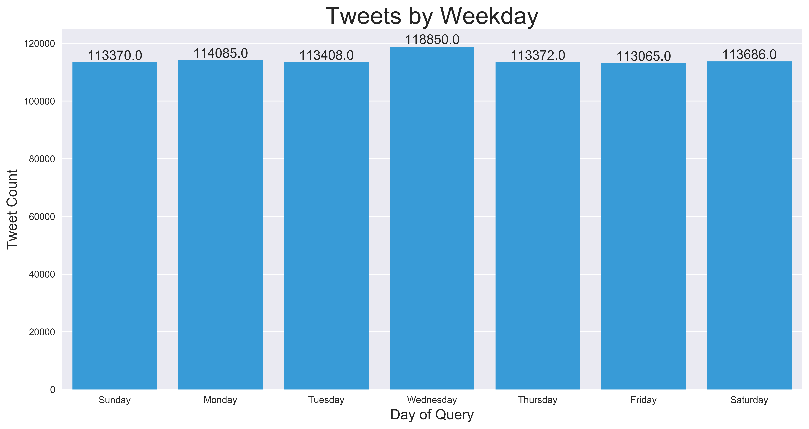
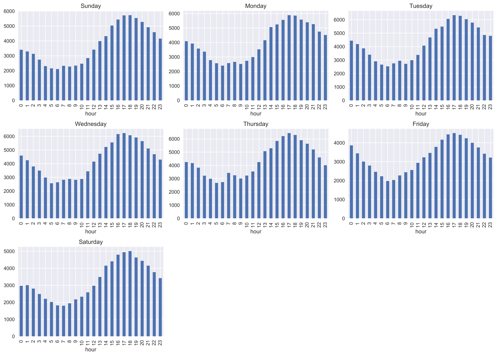
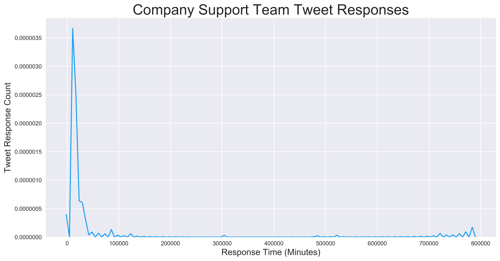
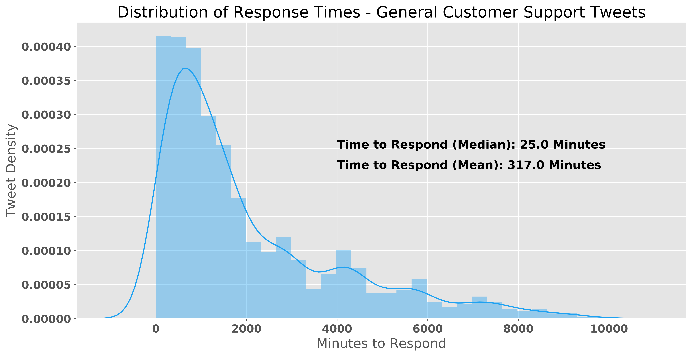
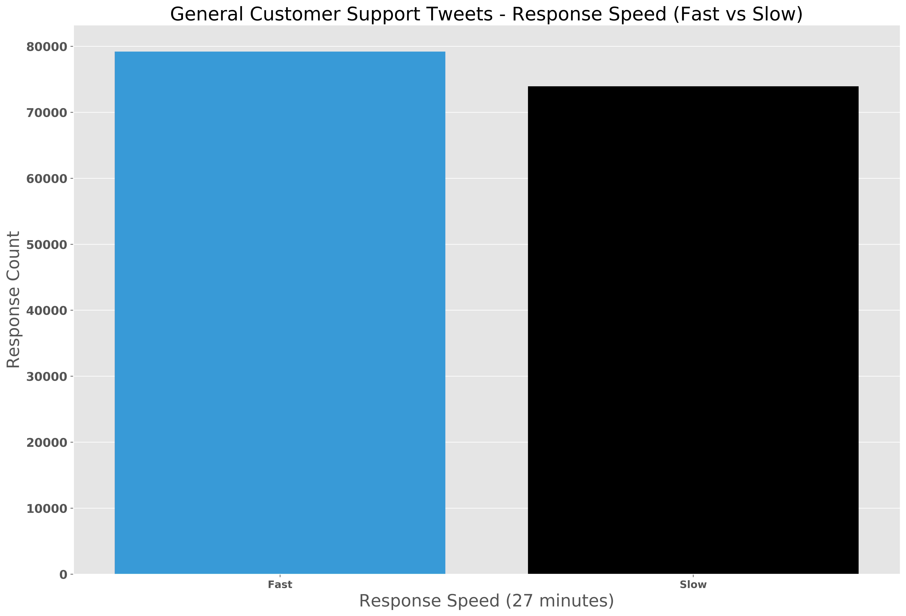
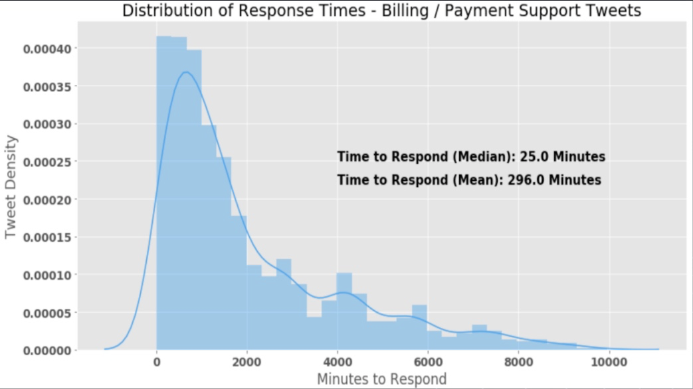
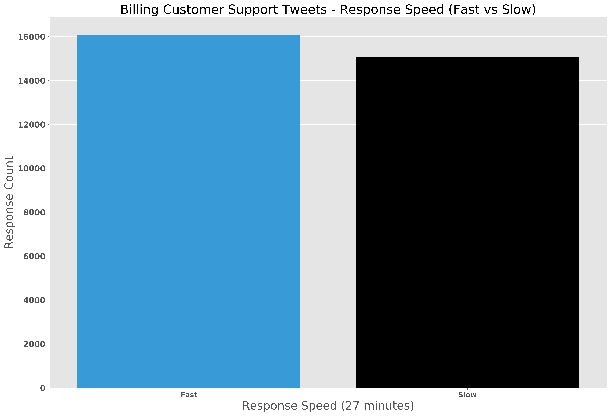
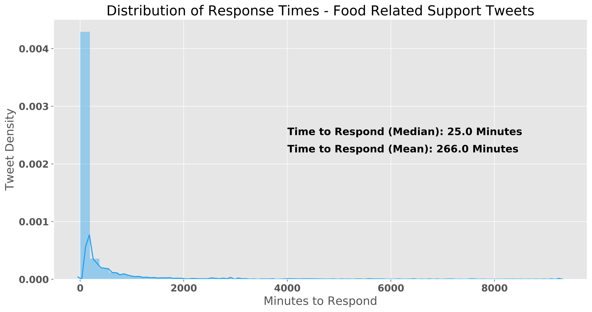
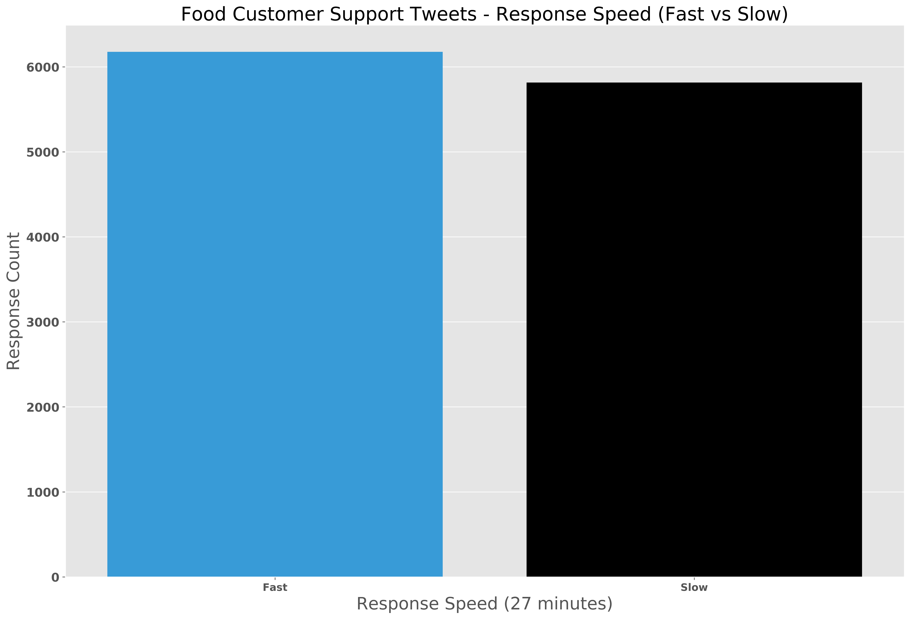

 

# I Need Help Fast! (An Analysis of Customer Support on Twitter)
-----
**Company Support Team Response Time Predictor** 
Zachary Villarreal
 
 

## Table of Contents
* [Background](#Background)
    * [Project Description](#Project-Description)
    * [Motivation](#Motivation)
* [Data](#Data)
    * [Pipeline](#Pipeline)
    * [Attributes](#Attributes)
* [Analysis](#Analysis)
    * [Exploratory Data Analysis](#Exploratory-Data-Analysis-(EDA))
    * [What About Response Times?](#What-About-Response-Times?)
* [Topic Modeling](#Hypothesis-Testing)
    * [Preparation](#Preparation)
    * [Latent Dirichlet Allocation (LDA)](#Latent-Dirichlet-Allocation-(LDA))
    * [T-Distributed Stochastic Neighbor Embedding](#T-Distributed-Stoachastic-Neighbor-Embedding)
    * [Topic Analysis](#Topic-Analysis)
* [Conclusion](#Conclusion)

## Background

### Project Description
---
Customer service is the assistance that a company will provide either before, during, or after a transaction is complete. Customer service is usually done through a company's website or via telephone, but as social media platforms become more commonplace, one can find these services available on these various platforms. One platform that has seen an influx of customer service interactions is Twitter. Twitter is an American social media platform on which users interact with others through shortened messages or "tweets." The content in tweets related to these specific inquiries often varies in word usage. However, they seem to be depicting some underlying subject when analyzed further.

<a href="#Table-of-Contents">Back to top</a>

 

### Motivation
---
We, as a society, have had a steady increase in participation in online transactions. As a result, our interactions with customer teams have also increased. We have all experienced longer than wanted wait times for a response from said teams. I, along with what I am sure is a substantial proportion of people, would like to understand why these wait times are so long and why certain people or companies receive a response much faster than the test. My goal is to analyze what goes into obtaining a fast versus a slow response from a customer support team on Twitter. Specifically, I will be looking at the behaviors of text and the relationship between their respective wait times.

Not only are customers seeking knowledge on how to receive a faster response, but customer support teams also try to see how their times match up against other companies within the same operating space. These teams are often under a high load of inbound requests from their customers and would like to know the analytics behind their responses. Are they targetting specific individuals faster than others, are they responding to those who include specific words within their requests, or are they just responding to those in the order they come in? This project will attempt to answer those questions, as well.

<a href="#Table-of-Contents">Back to top</a>

## Data

### Pipeline
---
**Data allocation**: 
* Twitter Customer Support Data: [Customer Support on Twitter](https://www.kaggle.com/thoughtvector/customer-support-on-twitter?)

**Data processing**: 
* The data was downloaded as a CSV (comma-separated values file).
* Pandas was used to import the data and aggregate it into one data frame.
* Exploratory Data Analysis and was performed once the data was cleaned.
    * The code to clean the data can be found [here](src/Data_Cleaning.ipynb).
    * The code depicting EDA can be found [here](src/EDA.ipynb)
* Visualization was completed using Matplotlib and Seaborn.
* Text Preprocessing was completed after EDA.
    * The code to conduct Text Preprocessing can be found [here](src/Helper.ipynb)
* Topic Modeling was completed after text was preprocessed.
    * The code to conduct Topic Modeling can be found [here](src/Topic_Modeling.ipynb)
* Classification Models were built using topics generated from topic modeling.
    * The code to conduct Modeling can be found [here](src/predictive_modeling.ipynb)
   

<a href="#Table-of-Contents">Back to top</a>

### Attributes
---
**Twitter Customer Service Data Set:**

| Feature Name      | Description                           | Unique Value Count |
|-------------------|:-------------------------------------:|-------------------:|
|Customer_Tweet_Id  | 6-Digit User I.D. Code for Anonymity  | 502967             |
|     Day_Tweeted   | Day of the Week the Tweet Was Sent  (Mon-Sun)| 7           |
|Customer_Tweet_Text|         Customer's Inquiry Text       | 605716             |
| Cluster Topic     | Text Topic Assigned Using Clustering  | 3                  |
|    Company_Name   | Name of Customer Service Team         | 108                |
|Company_Reponse_Text| Customer Service's Reponse Text      | 605130             |
| Minutes to Respond| How Long it Takes For a Response (Min)| 8536               |
| Response Speed    | Target Variable (Fast or Slow)        | 2                  |

* The data frame contains 689,281 rows and 9 features, explained in the table above.

<a href="#Table-of-Contents">Back to top</a>

## Analysis

### Exploratory Data Analysis (EDA)
---

As we set on this exploration of our data, I believe we should initially take a look at the top ten companies who currently exhibit the highest number of customer service inquiries.  
 

 

It can be observed that both AmazonHelp and AppleSupport far outweigh their competition, as far as the total number of inquiries via customers. But, one could argue that these counts are directly related to the total number of customers these companies have. I believe that this assumption is both fair and most likely valid. As a result, I want to look more into the distribution of the total number of tweets related to customer service over one week.

 

Interesting enough, there is little to no variance in the number of tweets related to customer support between the days of the week. However, let's dive a little deeper because we want to receive a more detailed understanding of these tweets. Next, I am interested in looking into the distribution of tweets over the hours of the days of the week.

 

We can infer that although the hour of the day does seem to have an impact on the number of tweets, the overall distribution of these tweets is constant throughout the week. While this data is all great to understand the magnitudes of the total distribution of tweets over each specific company and how time affects these inquiries, we are more interested in the information surrounding response times.

<a href="#Table-of-Contents">Back to top</a>

### What About Response Times? 
----
As mentioned above, this project is specifically looking at how we can predict a *fast* versus *slow* response time. As a result, I am interested in looking into the distribution of these response times. How each company specifically holds up to its competitors in terms of response speed on Twitter.

However, I think it is crucial first to determine what makes a customer support tweet response *fast* versus *slow*.  To do this, I need to look at the distribution of these times for all companies.

 

Wow! Overall, the distribution of these responses is skewed towards the left, which means that, on average, a relatively short amount of time needs to have waited to receive a response. However, there seems to be several instances where the amount of time exceeds 400,000 minutes, which is 277 days, not good at all! 

As I mentioned before, I want to be able to differentiate between fast and slow response times, to do that I believe the best method I can implore is taking the median of these times and setting that as the divider. Why am I taking the median and not the mean? Because, as I previously mentioned,  there were occasions where the total time waited far exceeded the norm and thus would throw off the total's mean since the mean is not-resilient to large outliers. As a result, I went with the median. 

`The median time for a response from a customer support team on Twitter is 27.0 minutes.` 

One might wonder if 27 minutes would be a good cutoff for these target times or response speed, most customers would be ecstatic with any response time under one hour! I understand that 27 minutes might be too low, however, as we will see later in this project, this cutoff point produced an even split between the number of fast versus slow responses for all companies.

Let's look at how this newly created `response speed` value is distributed over the companies with the ten highest number of customer inquiries.

 

Interesting, here we can see that the majority of responses by AmazonHelp, fall below the 27.0-minute mark, while AppleSupport's majority response time lands above the cutoff. However, we want to know how, if at all, the content of the customer support inquiry's text will affect the response time.

<a href="#Table-of-Contents">Back to top</a>

## Topic Modeling 
---
### Preparation
---
As previously mentioned, this data set's text corpus contained roughly 700,000 documents, or tweets, that averaged in length of ten words. As you might imagine, each customer's text varies drastically in terms of spelling and use of non-ascii characters. An example of this text is here: 
`Love @115940 but lost home internet&amp; just learned can’t Mirror Hulu on iPad hdmi adapter. Wanted to get Hulu live. Guess I’ll have to cancel all of Hulu &amp; look at @115946 or something like that 😢 why #Hulu why???`

In order to use this text for topic modeling via clustering using [Latent Dirichlet Allocation (LDA)](#https://towardsdatascience.com/nlp-extracting-the-main-topics-from-your-dataset-using-lda-in-minutes-21486f5aa925), I needed to use preprocessing techniques to clean the text. If you are interested in these techniques, you can view them [here](src/helper.py). Below, is an example of the above tweet after using these methods. 
`love lose home internet learn cant mirror hulu ipad hdmi adapter want get hulu live guess ill cancel hulu look something like hulu` 

Once the text was cleaned, I needed to convert it to a bag of words. You can think of the bag of words as a dictionary where each key is the word and the value is the number of times that word occurs in the the data set. However, we still need a corpus representation of our bag of words, meaning that I converted each pre-processed tweet into its own word frequency dictionary.

### Latent Dirichlet Allocation (LDA)
LDA was used to classify each tweet to a particular topic. It uses the text's data that we prepared above, to build a topic per distribution model and words per topic model. Running LDA on the corpus and the bag of words we generated is actually relatively simple. It assumes that every chunk of text we input into the model is somehow related, and believes that each document, or tweet, is produced a mixture of topics. The only thing that we really need to play with, within the model, is the number of unique topics, or clusters, we believe the text contains.From multiple attemps, I discovered that the best number of topics to assign was three.

### T-distributed Stochastic Neighbor Embedding
In order to visualize the clusters produced by LDA, I needed to reduce the dimensionality of the feature matrix. Because we were going to be reducing the dimensions from 200 to 2, I wanted a method that preserved clusters high dimensionality. I finally landed on using [t-distributed stoachastic neighbor embedding](#https://en.wikipedia.org/wiki/T-distributed_stochastic_neighbor_embedding). It models each high dimensional vector in a way that similar objects, or words, are modeled by nearby points and dissimilar objects are modeled by distant points with higher probabilities.

Let's look at the result we got from using TSNE to reduce dimensions on all of our customer support related tweets.

 

As we can see in the case above, the methods applied to visualize the clustering of customer support text were able to group the total corpus into three distinct clusters. But what do these clusters mean? Let's explore this further.

One of the things about unsupervised learning and an LDA model, is that we aren't given a topic name to the words that belong to each cluster, it is up to us humans to figure that out. Let's look at each cluster and those words that have the highest weights, or influence, to that classification.

`Cluster 0:` 
service, time, phone, customer, flight, order, day, thank, work, today 
`Cluster 1:` 
help, account, email, card, number, support, message, credit, contact, website 
`Cluster 2:` 
store, love, food, bag, stock, shop, staff, hand, bit, pack 

The soft clustering provided by LDA, allowed for some insight into what the topics were mainly about in each customer support inquiry. For example, cluster/topic 1 mainly discussed issues pertaining to credit or purchasing problems, while cluster/topic 3 talked about problems related to markets or food. However, there was a less clear topic for cluster 2, it seemed that any average inquiry, or sort of those not able to be defined as cluster 2 or 3, fell within cluster 0. Let's look at some examples of the topics the LDA clustering was able to pick up, using the nearest tweets to the cluster centers.

* Cluster 0: "General Customer Support Related Issues"
    * I’ve had 4-5 outages in the past month. WTF! @Ask_Spectrum

    * @AppleSupport how do I stop this auto brightness 😩😩 I like my screen dark and it just randomly gets bright

* Cluster 1: "Billing / Payment Related Issues"
    * @MicrosoftHelps @XboxSupport what’s this charge for? Keep getting it but cancelled everything I’m aware of https://t.co/TwELvJE9GV

    * @Uber_Support i paid money...it got debited in my account still ur app showing outstanding and not allowing to book. No one is responding

* Cluster 2: "Food / Market Related Issues"
    * @marksandspencer y do they charge you for a meat bag at colliers woods branch. If you buy meat your required to supply customers a free bag. Poor service.

    * I guess my soccer player costume wasn't good enough for a $3 burrito @ChipotleTweets

It seems that, with soft clustering methods, we can somewhat cluster these tweets into descrete topics. However, remember the question I am trying to answer, what factors go into these inquiries that can make a response time fast versus slow. In order to do this, I want to look at the impact these topics, or clusters, might have on the overall response time.

<a href="#Table-of-Contents">Back to top</a>

### Topic Analysis
---

I wanted to start my topic analysis with cluster 0, specifically those tweets that pertained to general customer support inquiries. I think it would be both interesting and beneficial if we first take a look at the distribution of these response times for this topic.

 

Interesting, you can see here that the distribution is skewed far to the left, but if you take a look at the x-axis, you can see that the minutes to respond ranges from 0 minutes to 10,000, which is approximately a week in waiting time. Still, the median time to respond is 25 minutes and the mean resposne time is 317 minutes, which is due to the large outlier problem we discussed earlier in this paper. 

Let's take a look a look at the fast versus slow comparison of response times for this topic.

 

Interesting, even though the mean time to respond was so high, it seems that the median is a better predictor for the relationship between a fast and slow response speed. Let's take a quick look at the these results for the other two generated topics.

`Cluster 1: "Billing / Payment Related Inquiries"`

 

 

`Cluster 2: "Food / Market Related Inquiries"`

 

 

Wow! We can see here that, while the variations might be small between each topic, they do seem to be having some degree of impact on the company's response speed. 

## Conclusion
---
The ultimate goal of this project is not only to see how these various reponse times vary, but whether the topics we were able to generate have hit on something fundamental that translates to something that can impact this data in the future. It is clear that the topics listed above, do have an impact on the repsponse speed. The techniques I applied are not limited to this field, in fact, they can be applied across pretty much all datasets that use text. Categorizing text, through topic modeling, has almost an unlimited amount of uses. 

In the future, I would like to be able to keep manipulating the number of clusters I believe the text belongs to, to try to create a clearer distinction between each topic. I would like to also use the feature vectors provided by the LDA model to input into a predictive model, to see how this performs in a train test split of the current data, to predict response speed. 